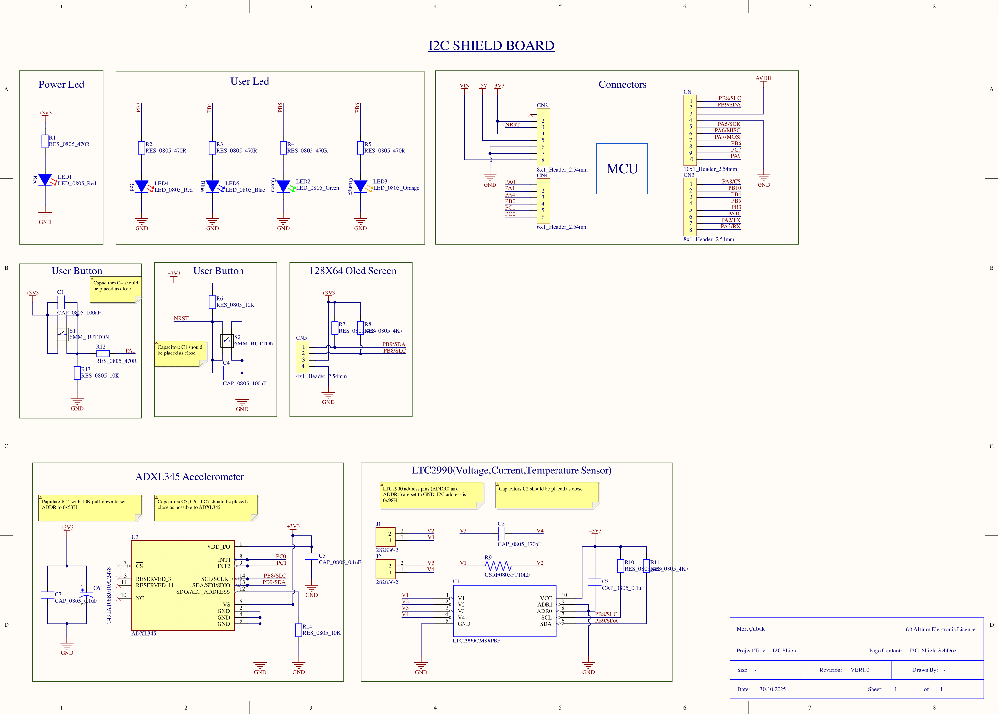
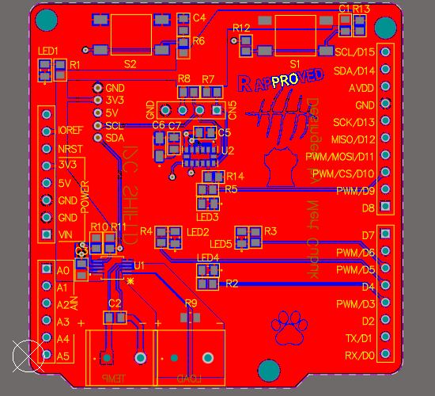
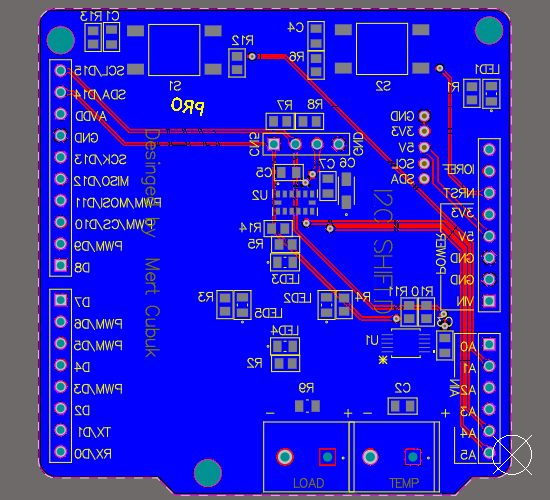
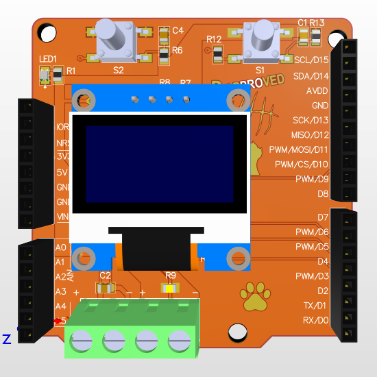
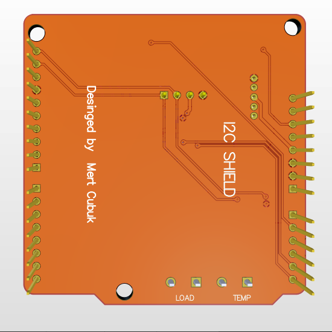

I2C Shield Board (Arduino + STM32 Nucleo-64)

##  Proje Hakkında  
Bu proje, hem **Arduino UNO** hem de **STM32 NUCLEO-64** uyumlu olacak şekilde tasarlanmış I²C tabanlı sensör ve ekran shield kartıdır.  
Kart, temel I²C çevre birimleriyle (**OLED ekran, ADXL345, LTC2990**) test ve geliştirme ortamı sağlamak amacıyla geliştirilmiştir.  

---

##  Teknik Özellikler  

| Özellik | Açıklama |
|----------|-----------|
| **MCU Uyumluluğu** | Arduino UNO / STM32 NUCLEO-64 pin uyumlu |
| **Haberleşme** | I²C (SCL, SDA), 3.3V/5V seviye desteği |
| **Güç Girişi** | 3.3V / 5V DC |
| **Sensörler** | ADXL345 (Accelerometer), LTC2990 (Voltage-Current-Temp) |
| **Görsel Birim** | 128×64 OLED ekran (I²C) |
| **Kullanıcı Arayüzü** | 2 adet buton, 4 adet LED |
| **Kart Boyutu** | ~55.5 mm × 57.13 mm |
| **Katman Sayısı** | 2 (Top / Bottom) |
| **Yazılım** | Altium Designer 24.2 |
| **Üretim Durumu** | Gerber çıkışı hazır, JLCPCB uyumlu |

##  Fonksiyonel Bloklar  

- **Power Block:** 3.3V & 5V dağıtımı, decoupling kondansatörleri  
- **User Interface Block:** Butonlar, LED’ler, test pinleri  
- **Sensor Block:**  
  - ADXL345 – 3 eksen ivme ölçer  
  - LTC2990 – voltaj, akım ve sıcaklık izleme sensörü  
- **Display Block:** 128×64 OLED ekran (I²C)  
- **Connectors:** Arduino / Nucleo pin header dizilimi  

## 🗂️ Proje Yapısı  

```text
📂 I2C_Shield
 ┣ 📜 I2C_Shield.PrjPcb
 ┣ 📜 I2C_Shield.SchDoc
 ┣ 📜 I2C_Shield.PcbDoc
 ┣ 📜 README.md
 ┣ 📂 Gerber_Rar
 ┃ ┗ 📦 Gerber_Files.rar  → Üretime gönderilecek dosya (JLCPCB)
 ┣ 📂 Library
 ┃ ┣ 📜 Custom_Components.SchLib
 ┃ ┣ 📜 Custom_Footprints.PcbLib
 ┃ ┗ 📂 Step_Models  → Kullanılan 3D modeller
 ┣ 📂 PCB Print
 ┃ ┗ 📜 I2C_Shield_PCB.pdf  → PCB görünümü (2D)
 ┣ 📂 PDF3D
 ┃ ┗ 📜 I2C_Shield_3D.pdf  → 3D PDF görünümü
 ┣ 📂 Schematic Print
 ┃ ┗ 📜 I2C_Shield_Schematic.pdf  → Şematik çıktısı
 ┗ 📂 Project Outputs
   ┣ 📜 BOM.xlsx
   ┣ 📜 Design Rule Check - I2C_Shield.html
   ┣ 📜 Status Report.txt
   ┗ 📂 Gerber / NC Drill / STEP dosyaları


| Görsel                                            | Açıklama         |
| ------------------------------------------------- | ---------------- |
|    | Şematik görünümü |
|        | PCB Top Layer    |
|  | PCB Bottom Layer |
|           | 3D üst görünüm   |
|     | 3D alt görünüm   |

Öğrenilenler / Kazanımlar  

- Çoklu I²C çevre birimlerinin kart üzerinde adres yönetimi  
- Ground plane & polygon pour optimizasyonu  
- Gerber, BOM ve DRC çıktılarının hazırlanması  
- 3D step model entegrasyonu  
- PCB üzerinde kişisel marka/logonun uygulanması  

---

© 2025 Mert Çubuk  
*Designed and documented with Altium Designer 24.2*  
